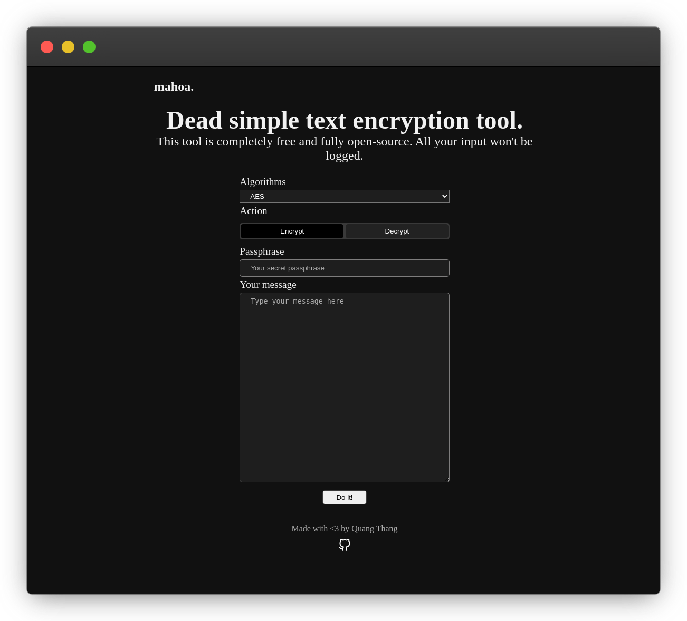

<h1 align="center">mahoa.</h1>

## What is this?

`mahoa` is a simple web app for encrypting and decrypting text using `CryptoJS`. It currently supports AES, DES and Triple DES.

You can use it instantly [here](https://mahoa.now.sh)
## Is it safe?
This is a client-side application. No information will be sent back to the server or stored in anyway.

But no, *I can't guarantee that it's safe*. There might be some vulnerable in `CryptoJS`. Therefore, **use it at your own risk**.

## This code is such a mess!
Yep, I agree! I'm still learning web development. It isn't clean code.

Hence, all kind of contribution are welcomed!
